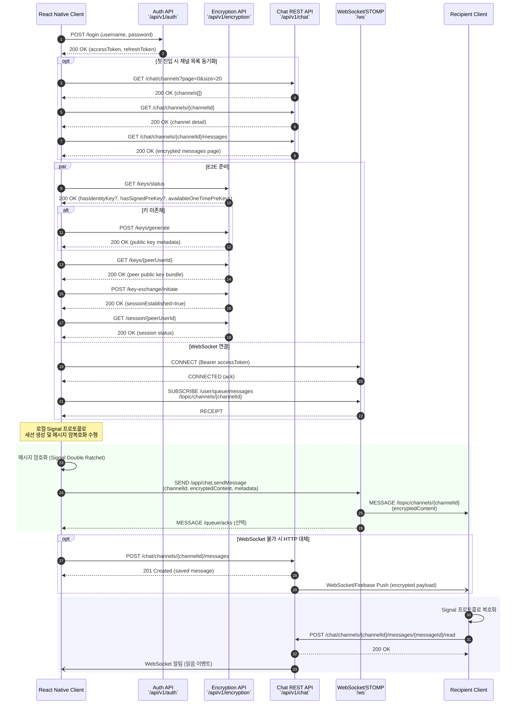

```mermaid
sequenceDiagram
    autonumber
    participant RN as React Native Client
    participant AuthAPI as Auth API<br/>`/api/v1/auth`
    participant EncAPI as Encryption API<br/>`/api/v1/encryption`
    participant ChatAPI as Chat REST API<br/>`/api/v1/chat`
    participant WS as WebSocket/STOMP<br/>`/ws`
    participant Recv as Recipient Client

    RN->>AuthAPI: POST /login (username, password)
    AuthAPI-->>RN: 200 OK (accessToken, refreshToken)

    opt 첫 진입 시 채널 목록 동기화
        RN->>ChatAPI: GET /chat/channels?page=0&size=20
        ChatAPI-->>RN: 200 OK (channels[])
        RN->>ChatAPI: GET /chat/channels/{channelId}
        ChatAPI-->>RN: 200 OK (channel detail)
        RN->>ChatAPI: GET /chat/channels/{channelId}/messages
        ChatAPI-->>RN: 200 OK (encrypted messages page)
    end

    par E2E 준비
        RN->>EncAPI: GET /keys/status
        EncAPI-->>RN: 200 OK (hasIdentityKey?, hasSignedPreKey?, availableOneTimePreKeys)

        alt 키 미존재
            RN->>EncAPI: POST /keys/generate
            EncAPI-->>RN: 200 OK (public key metadata)
        end

        RN->>EncAPI: GET /keys/{peerUserId}
        EncAPI-->>RN: 200 OK (peer public key bundle)

        RN->>EncAPI: POST /key-exchange/initiate
        EncAPI-->>RN: 200 OK (sessionEstablished=true)

        RN->>EncAPI: GET /session/{peerUserId}
        EncAPI-->>RN: 200 OK (session status)
    and WebSocket 연결
        RN->>WS: CONNECT (Bearer accessToken)
        WS-->>RN: CONNECTED (ack)
        RN->>WS: SUBSCRIBE /user/queue/messages<br/>/topic/channels/{channelId}
        WS-->>RN: RECEIPT
    end

    note over RN: 로컬 Signal 프로토콜로<br/>세션 생성 및 메시지 암복호화 수행

    rect rgba(200,255,200,0.2)
        RN->>RN: 메시지 암호화 (Signal Double Ratchet)
        RN->>WS: SEND /app/chat.sendMessage<br/>(channelId, encryptedContent, metadata)
        WS->>Recv: MESSAGE /topic/channels/{channelId}<br/>(encryptedContent)
        WS-->>RN: MESSAGE /queue/acks (선택)
    end

    opt WebSocket 불가 시 HTTP 대체
        RN->>ChatAPI: POST /chat/channels/{channelId}/messages
        ChatAPI-->>RN: 201 Created (saved message)
        ChatAPI-)Recv: WebSocket/Firebase Push (encrypted payload)
    end

    rect rgba(200,200,255,0.2)
        Recv->>Recv: Signal 프로토콜로 복호화
        Recv->>ChatAPI: POST /chat/channels/{channelId}/messages/{messageId}/read
        ChatAPI-->>Recv: 200 OK
        ChatAPI-)RN: WebSocket 알림 (읽음 이벤트)
    end
```