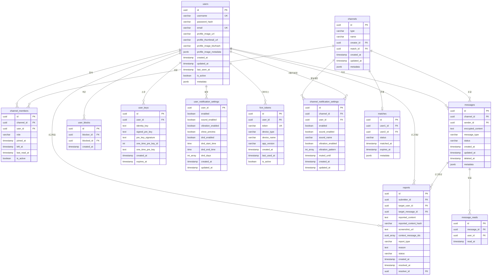

# 채팅 SDK - Database Schema 설계

## 개요

**설계 원칙**:
- 관계형 데이터 (사용자, 채널, 매칭) → PostgreSQL
- 메시지 데이터 (대량, 시계열) → MongoDB
- 캐시 및 실시간 상태 → Redis
- 여러 DBMS에 포팅 가능한 표준 SQL 사용

---

## ERD (Entity Relationship Diagram)



**ERD 확인 사이트**:
- [Mermaid Live Editor](https://mermaid.live/)
- [dbdiagram.io](https://dbdiagram.io/)
- GitHub에서 바로 렌더링됨

---

## 1. PostgreSQL 스키마 (관계형 데이터)

### 1.1 users (사용자)

```sql
CREATE TABLE users (
    id UUID PRIMARY KEY DEFAULT gen_random_uuid(),
    username VARCHAR(50) NOT NULL UNIQUE,
    password_hash VARCHAR(255) NOT NULL,
    email VARCHAR(255) UNIQUE,
    
    -- 프로필 이미지 (성능 최적화)
    profile_image_url VARCHAR(500),        -- 원본 이미지 URL
    profile_thumbnail_url VARCHAR(500),    -- 썸네일 URL (100x100)
    profile_image_blurhash VARCHAR(50),    -- BlurHash (placeholder)
    profile_image_metadata JSONB,          -- 이미지 메타데이터
    
    created_at TIMESTAMP NOT NULL DEFAULT CURRENT_TIMESTAMP,
    updated_at TIMESTAMP NOT NULL DEFAULT CURRENT_TIMESTAMP,
    last_seen_at TIMESTAMP,
    is_active BOOLEAN NOT NULL DEFAULT true,
    metadata JSONB,
    
    CONSTRAINT username_length CHECK (char_length(username) >= 3)
);

CREATE INDEX idx_users_username ON users(username);
CREATE INDEX idx_users_email ON users(email);
CREATE INDEX idx_users_is_active ON users(is_active);
CREATE INDEX idx_users_last_seen ON users(last_seen_at);
```

**컬럼 설명**:
- `id`: 사용자 고유 ID (UUID)
- `username`: 사용자명 (고유)
- `password_hash`: 비밀번호 해시 (bcrypt)
- `email`: 이메일 (선택, 고유)
- `profile_image_url`: 프로필 사진 URL (원본, 최대 500자)
- `profile_thumbnail_url`: 프로필 사진 썸네일 URL (100x100)
- `profile_image_blurhash`: BlurHash 문자열 (로딩 중 placeholder)
- `profile_image_metadata`: 이미지 메타데이터 (JSON)
  ```json
  {
    "width": 800,
    "height": 800,
    "format": "webp",
    "size_bytes": 45000,
    "uploaded_at": "2025-10-26T12:00:00Z",
    "versions": {
      "original": "https://cdn/profiles/alice-original.webp",
      "large": "https://cdn/profiles/alice-large.webp",      // 400x400
      "medium": "https://cdn/profiles/alice-medium.webp",    // 200x200
      "small": "https://cdn/profiles/alice-small.webp",      // 100x100
      "webp": "https://cdn/profiles/alice.webp",
      "jpg": "https://cdn/profiles/alice.jpg"
    }
  }
  ```
- `created_at`: 계정 생성 시간
- `updated_at`: 정보 수정 시간
- `last_seen_at`: 마지막 접속 시간
- `is_active`: 계정 활성화 여부
- `metadata`: 추가 정보 (JSON)

**프로필 이미지 성능 최적화 전략**:

1. **다중 해상도 생성** (Responsive Images)
   - Original: 800x800 (프로필 상세)
   - Large: 400x400 (프로필 팝업)
   - Medium: 200x200 (채팅 헤더)
   - Small: 100x100 (채팅 목록, 메시지)

2. **포맷 최적화**
   - WebP: 기본 포맷 (Chrome, Edge, Firefox)
   - JPEG: 폴백 (Safari 구버전)
   - AVIF: 최신 브라우저 (미래 대응)

3. **BlurHash**
   - 이미지 로딩 전 흐릿한 placeholder 표시
   - 20-30바이트로 이미지 표현
   - 빠른 UX 개선

4. **CDN 캐싱**
   - CloudFront / Cloudflare
   - Edge 서버에서 이미지 캐싱
   - 지역별 최적화된 전송

5. **Lazy Loading**
   - 화면에 보이는 이미지만 로드
   - Intersection Observer 사용

6. **이미지 압축**
   - 원본 업로드 시 85% 품질 압축
   - WebP로 30-50% 크기 절감

---

### 1.2 user_keys (Signal Protocol 키)

```sql
CREATE TABLE user_keys (
    id UUID PRIMARY KEY DEFAULT gen_random_uuid(),
    user_id UUID NOT NULL REFERENCES users(id) ON DELETE CASCADE,
    identity_key TEXT NOT NULL,
    signed_pre_key TEXT NOT NULL,
    pre_key_signature TEXT NOT NULL,
    one_time_pre_key_id INTEGER,
    one_time_pre_key TEXT,
    created_at TIMESTAMP NOT NULL DEFAULT CURRENT_TIMESTAMP,
    expires_at TIMESTAMP,
    
    CONSTRAINT fk_user_keys_user FOREIGN KEY (user_id) REFERENCES users(id)
);

CREATE INDEX idx_user_keys_user_id ON user_keys(user_id);
CREATE INDEX idx_user_keys_expires_at ON user_keys(expires_at);
```

**컬럼 설명**:
- `identity_key`: Signal Protocol Identity Key
- `signed_pre_key`: 서명된 Pre Key
- `pre_key_signature`: Pre Key 서명
- `one_time_pre_key_id`: One-Time Pre Key ID
- `one_time_pre_key`: One-Time Pre Key (사용 후 삭제)
- `expires_at`: 키 만료 시간

---

### 1.3 channels (채널/채팅방)

```sql
CREATE TABLE channels (
    id UUID PRIMARY KEY DEFAULT gen_random_uuid(),
    type VARCHAR(20) NOT NULL CHECK (type IN ('DIRECT', 'GROUP')),  -- 실제 구현: 대문자 enum 값 사용
    name VARCHAR(255),
    creator_id UUID NOT NULL REFERENCES users(id) ON DELETE SET NULL,
    match_id UUID REFERENCES matches(id) ON DELETE SET NULL,
    created_at TIMESTAMP NOT NULL DEFAULT CURRENT_TIMESTAMP,
    updated_at TIMESTAMP NOT NULL DEFAULT CURRENT_TIMESTAMP,
    version BIGINT DEFAULT 0,  -- 낙관적 락을 위한 버전 필드 (실제 구현에 포함됨)
    metadata JSONB,
    
    CONSTRAINT fk_channels_creator FOREIGN KEY (creator_id) REFERENCES users(id),
    CONSTRAINT fk_channels_match FOREIGN KEY (match_id) REFERENCES matches(id)
);

CREATE INDEX idx_channels_type ON channels(type);
CREATE INDEX idx_channels_creator ON channels(creator_id);
CREATE INDEX idx_channels_match ON channels(match_id);
CREATE INDEX idx_channels_created_at ON channels(created_at);
```

**컬럼 설명**:
- `type`: 채널 타입 (실제 구현)
  - `DIRECT`: 1:1 채팅
  - `GROUP`: 그룹 채팅
- `name`: 채널명 (그룹 채팅만 사용, DIRECT 채널은 null)
- `creator_id`: 채널 생성자
- `match_id`: 매칭 ID (소개팅 앱 전용, nullable)
- `version`: 낙관적 락을 위한 버전 필드 (실제 구현에 포함)
- `metadata`: 추가 정보 (JSONB)

---

### 1.4 channel_members (채널 참여자)

```sql
CREATE TABLE channel_members (
    id UUID PRIMARY KEY DEFAULT gen_random_uuid(),
    channel_id UUID NOT NULL REFERENCES channels(id) ON DELETE CASCADE,
    user_id UUID NOT NULL REFERENCES users(id) ON DELETE CASCADE,
    role VARCHAR(20) NOT NULL DEFAULT 'MEMBER' CHECK (role IN ('ADMIN', 'MEMBER')),  -- 실제 구현: 대문자 enum 값 사용
    joined_at TIMESTAMP NOT NULL DEFAULT CURRENT_TIMESTAMP,
    left_at TIMESTAMP,
    last_read_at TIMESTAMP,
    is_active BOOLEAN NOT NULL DEFAULT true,
    version BIGINT DEFAULT 0,  -- 낙관적 락을 위한 버전 필드 (실제 구현에 포함됨)
    
    CONSTRAINT fk_channel_members_channel FOREIGN KEY (channel_id) REFERENCES channels(id),
    CONSTRAINT fk_channel_members_user FOREIGN KEY (user_id) REFERENCES users(id),
    CONSTRAINT unique_active_membership UNIQUE (channel_id, user_id)  -- 실제 구현: (channel_id, user_id) 유니크 제약
);

CREATE INDEX idx_channel_members_channel ON channel_members(channel_id);
CREATE INDEX idx_channel_members_user ON channel_members(user_id);
CREATE INDEX idx_channel_members_active ON channel_members(is_active);
CREATE INDEX idx_channel_members_last_read ON channel_members(last_read_at);
```

**컬럼 설명**:
- `role`: 역할 (실제 구현)
  - `ADMIN`: 관리자
  - `MEMBER`: 일반 멤버
- `joined_at`: 참여 시간
- `left_at`: 나간 시간 (null이면 현재 참여 중)
- `last_read_at`: 마지막으로 읽은 시간 (읽지 않은 메시지 계산)
- `is_active`: 현재 참여 중 여부
- `version`: 낙관적 락을 위한 버전 필드 (실제 구현에 포함)

---

### 1.5 matches (매칭 - 소개팅 앱 전용)

```sql
CREATE TABLE matches (
    id UUID PRIMARY KEY DEFAULT gen_random_uuid(),
    user1_id UUID NOT NULL REFERENCES users(id) ON DELETE CASCADE,
    user2_id UUID NOT NULL REFERENCES users(id) ON DELETE CASCADE,
    status VARCHAR(20) NOT NULL DEFAULT 'ACTIVE' 
        CHECK (status IN ('ACTIVE', 'ACCEPTED', 'REJECTED', 'ENDED', 'EXPIRED', 'CANCELLED')),  -- 실제 구현에 맞게 업데이트
    matched_at TIMESTAMP NOT NULL DEFAULT CURRENT_TIMESTAMP,
    expires_at TIMESTAMP,
    metadata JSONB,
    
    CONSTRAINT fk_matches_user1 FOREIGN KEY (user1_id) REFERENCES users(id),
    CONSTRAINT fk_matches_user2 FOREIGN KEY (user2_id) REFERENCES users(id),
    CONSTRAINT check_different_users CHECK (user1_id != user2_id)
);

CREATE INDEX idx_matches_user1 ON matches(user1_id);
CREATE INDEX idx_matches_user2 ON matches(user2_id);
CREATE INDEX idx_matches_status ON matches(status);
CREATE INDEX idx_matches_expires_at ON matches(expires_at);
```

**컬럼 설명**:
- `status`: 매칭 상태 (실제 구현)
  - `ACTIVE`: 활성 매칭
  - `ACCEPTED`: 수락됨
  - `REJECTED`: 거부됨
  - `ENDED`: 종료됨
  - `EXPIRED`: 만료
  - `CANCELLED`: 취소
- `matched_at`: 매칭 성사 시간
- `expires_at`: 매칭 만료 시간
- `metadata`: 매칭 관련 추가 정보

---

### 1.6 user_blocks (차단)

```sql
CREATE TABLE user_blocks (
    id UUID PRIMARY KEY DEFAULT gen_random_uuid(),
    blocker_id UUID NOT NULL REFERENCES users(id) ON DELETE CASCADE,
    blocked_id UUID NOT NULL REFERENCES users(id) ON DELETE CASCADE,
    created_at TIMESTAMP NOT NULL DEFAULT CURRENT_TIMESTAMP,
    
    CONSTRAINT fk_user_blocks_blocker FOREIGN KEY (blocker_id) REFERENCES users(id),
    CONSTRAINT fk_user_blocks_blocked FOREIGN KEY (blocked_id) REFERENCES users(id),
    CONSTRAINT unique_block UNIQUE (blocker_id, blocked_id),
    CONSTRAINT check_different_users CHECK (blocker_id != blocked_id)
);

CREATE INDEX idx_user_blocks_blocker ON user_blocks(blocker_id);
CREATE INDEX idx_user_blocks_blocked ON user_blocks(blocked_id);
```

**컬럼 설명**:
- `blocker_id`: 차단한 사용자
- `blocked_id`: 차단당한 사용자

---

### 1.7 reports (신고)

```sql
CREATE TABLE reports (
    id UUID PRIMARY KEY DEFAULT gen_random_uuid(),
    submitter_id UUID NOT NULL REFERENCES users(id) ON DELETE SET NULL,
    target_user_id UUID REFERENCES users(id) ON DELETE SET NULL,
    target_message_id UUID,
    
    -- 신고자가 복호화하여 제공한 내용 (E2E 암호화 절충안)
    reported_content TEXT NOT NULL,
    reported_content_hash VARCHAR(64),  -- SHA-256 해시 (검증용)
    
    -- 추가 증거
    screenshot_url TEXT,  -- 스크린샷 URL (선택)
    
    -- 컨텍스트 정보
    context_message_ids UUID[],  -- 전후 메시지 ID들 (패턴 분석용)
    
    report_type VARCHAR(50) NOT NULL 
        CHECK (report_type IN ('SPAM', 'HARASSMENT', 'INAPPROPRIATE', 'OTHER')),  -- 실제 구현: 대문자 enum 값
    reason TEXT NOT NULL,
    status VARCHAR(20) NOT NULL DEFAULT 'PENDING'
        CHECK (status IN ('PENDING', 'REVIEWED', 'RESOLVED', 'DISMISSED')),  -- 실제 구현: 대문자 enum 값
    created_at TIMESTAMP NOT NULL DEFAULT CURRENT_TIMESTAMP,
    resolved_at TIMESTAMP,
    resolver_id UUID REFERENCES users(id) ON DELETE SET NULL,
    
    CONSTRAINT fk_reports_submitter FOREIGN KEY (submitter_id) REFERENCES users(id),
    CONSTRAINT fk_reports_target_user FOREIGN KEY (target_user_id) REFERENCES users(id),
    CONSTRAINT fk_reports_resolver FOREIGN KEY (resolver_id) REFERENCES users(id)
);

CREATE INDEX idx_reports_submitter ON reports(submitter_id);
CREATE INDEX idx_reports_target_user ON reports(target_user_id);
CREATE INDEX idx_reports_target_message ON reports(target_message_id);
CREATE INDEX idx_reports_status ON reports(status);
CREATE INDEX idx_reports_created_at ON reports(created_at);
```

**컬럼 설명**:
- `submitter_id`: 신고를 제출한 사용자
- `target_user_id`: 신고 대상 사용자
- `target_message_id`: 신고 대상 메시지 ID (MongoDB 참조)
- `reported_content`: 신고자가 복호화한 메시지 내용
- `reported_content_hash`: 내용의 SHA-256 해시 (무결성 검증)
- `screenshot_url`: 증거 스크린샷 URL (선택)
- `context_message_ids`: 전후 메시지 ID 배열 (패턴 분석용)
- `report_type`: 신고 유형
- `reason`: 신고 사유
- `status`: 처리 상태
- `resolver_id`: 신고를 처리한 관리자

**E2E 암호화 절충안**:
- 신고자가 클라이언트에서 메시지를 복호화하여 제공
- 해시값으로 내용 무결성 검증
- 관리자는 신고된 내용만 확인 (모든 메시지 접근 불가)
- E2E 암호화 원칙 유지하면서 신고 시스템 작동

---

## 2. MongoDB 스키마 (메시지 데이터)

### 2.1 messages (메시지)

```javascript
{
  _id: ObjectId,
  id: UUID,  // PostgreSQL과 동일한 ID 사용
  channel_id: UUID,
  sender_id: UUID,
  
  // E2E 암호화된 내용
  encrypted_content: String,  // 암호화된 메시지 본문
  
  message_type: String,  // 'TEXT', 'IMAGE', 'FILE' (실제 구현: 대문자 enum 값)
  
  // 파일/이미지 메타데이터 (암호화되지 않음)
  file_metadata: {
    file_name: String,
    file_size: Number,
    mime_type: String,
    encrypted_file_url: String,  // 암호화된 파일 저장 경로
    thumbnail_url: String        // 썸네일 (선택)
  },
  
  status: String,  // 'SENT', 'DELIVERED', 'DELETED' (실제 구현: 대문자 enum 값)
  
  created_at: ISODate,
  updated_at: ISODate,
  deleted_at: ISODate,
  
  // 메시지 수정 이력 (E2E 암호화)
  edit_history: [
    {
      encrypted_content: String,
      edited_at: ISODate
    }
  ],
  
  // 추가 메타데이터
  metadata: {
    reply_to: UUID,  // 답장 대상 메시지
    mentions: [UUID],  // 언급된 사용자들
  }
}
```

**인덱스**:
```javascript
db.messages.createIndex({ channel_id: 1, created_at: -1 })
db.messages.createIndex({ sender_id: 1, created_at: -1 })
db.messages.createIndex({ channel_id: 1, status: 1 })
db.messages.createIndex({ created_at: 1 }, { expireAfterSeconds: 2592000 })  // 30일 TTL (optional)
```

---

### 2.2 message_reads (읽음 표시)

```javascript
{
  _id: ObjectId,
  message_id: UUID,
  channel_id: UUID,
  user_id: UUID,
  read_at: ISODate
}
```

**인덱스**:
```javascript
db.message_reads.createIndex({ message_id: 1, user_id: 1 }, { unique: true })
db.message_reads.createIndex({ channel_id: 1, user_id: 1, read_at: -1 })
```

---

## 3. Redis 스키마 (캐시 및 실시간 상태)

### 3.1 사용자 온라인 상태

```
Key: user:online:{user_id}
Type: String
Value: "true" | "false"
TTL: 300 (5분)

예시:
SET user:online:123e4567-e89b-12d3-a456-426614174000 "true" EX 300
```

---

### 3.2 WebSocket 세션 관리

```
Key: session:{user_id}
Type: String
Value: {session_id}
TTL: 3600 (1시간)

예시:
SET session:123e4567-e89b-12d3-a456-426614174000 "ws-session-abc123" EX 3600
```

---

### 3.3 타이핑 인디케이터

```
Key: typing:{channel_id}:{user_id}
Type: String
Value: timestamp
TTL: 10 (10초)

예시:
SET typing:channel-123:user-456 "1698345600" EX 10
```

---

### 3.4 읽지 않은 메시지 카운트 (캐시)

```
Key: unread:{user_id}:{channel_id}
Type: String
Value: {count}
TTL: 3600 (1시간)

예시:
SET unread:user-123:channel-456 "5" EX 3600
INCR unread:user-123:channel-456
```

---

### 3.5 Pub/Sub (실시간 메시지 배포)

```
Channel: channel:{channel_id}

메시지 형식:
{
  "type": "message" | "typing" | "read" | "user_joined" | "user_left",
  "channel_id": "uuid",
  "user_id": "uuid",
  "data": { ... }
}
```

---

### 3.6 FCM 토큰 캐시

```
Key: user:fcm_token:{user_id}
Type: String
Value: fcm_token_string
TTL: 3600 (1시간)

예시:
SET user:fcm_token:alice-id "fcm_token_abc123" EX 3600
GET user:fcm_token:alice-id
```

**목적**: 
- 빠른 FCM 토큰 조회
- DB 부하 감소
- 푸시 알림 전송 시 사용

---

### 3.7 총 읽지 않은 메시지 카운트 (앱 배지)

```
Key: unread:total:{user_id}
Type: String
Value: {total_count}
TTL: 없음 (명시적 삭제)

예시:
SET unread:total:alice-id "12"
INCR unread:total:alice-id
DECR unread:total:alice-id
GET unread:total:alice-id
```

**업데이트 시점**:
- 새 메시지 수신 시: INCR
- 메시지 읽음 시: DECR
- 채널 진입 시: 해당 채널의 unread 만큼 DECR

---

## 4. 데이터 보관 정책

### 4.1 메시지 자동 삭제 (Config 설정)

**MongoDB TTL Index 사용**:
```javascript
// messageRetentionPeriod가 설정된 경우
db.messages.createIndex(
  { created_at: 1 }, 
  { expireAfterSeconds: {configValue} }
)

// 예: 7일 = 604800초
db.messages.createIndex(
  { created_at: 1 }, 
  { expireAfterSeconds: 604800 }
)
```

**또는 Application Level 삭제**:
- 스케줄러로 주기적으로 오래된 메시지 삭제
- 채널별로 다른 보관 기간 적용 가능

---

### 4.2 삭제된 메시지 처리

메시지 삭제 시:
1. `status`를 'deleted'로 변경
2. `deleted_at` 타임스탬프 기록
3. `encrypted_content`를 빈 값 또는 "deleted" 텍스트로 대체
4. 조회 시 "삭제된 메시지입니다" 표시

---

## 5. 마이그레이션 전략

### 5.1 PostgreSQL 마이그레이션

**도구**: Flyway 또는 Liquibase 추천

```
db/migration/
├── V1__create_users_table.sql
├── V2__create_user_keys_table.sql
├── V3__create_channels_table.sql
├── V4__create_channel_members_table.sql
├── V5__create_matches_table.sql
├── V6__create_user_blocks_table.sql
├── V7__create_reports_table.sql
├── V8__create_user_notification_settings_table.sql
├── V9__create_channel_notification_settings_table.sql
└── V10__create_fcm_tokens_table.sql
```

---

### 5.2 MongoDB 마이그레이션

**도구**: mongosh 스크립트 또는 Application Code

```javascript
// migrations/001_create_messages_indexes.js
db.messages.createIndex({ channel_id: 1, created_at: -1 });
db.messages.createIndex({ sender_id: 1, created_at: -1 });
// ...
```

---

## 6. 포팅 가능성

### 6.1 PostgreSQL 대신 MySQL 사용 시

주요 변경사항:
- `UUID` → `CHAR(36)` 또는 `BINARY(16)`
- `gen_random_uuid()` → `UUID()`
- `JSONB` → `JSON`
- `CURRENT_TIMESTAMP` 동일

### 6.2 MongoDB 대신 PostgreSQL 사용 시

```sql
CREATE TABLE messages (
    id UUID PRIMARY KEY,
    channel_id UUID NOT NULL,
    sender_id UUID NOT NULL,
    encrypted_content TEXT NOT NULL,
    message_type VARCHAR(20),
    status VARCHAR(20),
    created_at TIMESTAMP NOT NULL,
    updated_at TIMESTAMP,
    deleted_at TIMESTAMP,
    metadata JSONB,
    
    CONSTRAINT fk_messages_channel FOREIGN KEY (channel_id) REFERENCES channels(id),
    CONSTRAINT fk_messages_sender FOREIGN KEY (sender_id) REFERENCES users(id)
);

-- 파티셔닝으로 성능 최적화
CREATE TABLE messages_2025_01 PARTITION OF messages
    FOR VALUES FROM ('2025-01-01') TO ('2025-02-01');
```

---

## 7. 성능 최적화 고려사항

### 7.1 인덱스 전략
- 자주 조회되는 컬럼에 인덱스 생성
- 복합 인덱스 활용 (예: channel_id + created_at)
- 불필요한 인덱스는 제거 (쓰기 성능 저하)

### 7.2 파티셔닝
- 메시지 테이블: 날짜 기준 파티셔닝
- 대용량 데이터 처리 시 필수

### 7.3 커넥션 풀
```yaml
spring:
  datasource:
    hikari:
      maximum-pool-size: 10
      minimum-idle: 5
```

---

## 8. 보안 고려사항

### 8.1 E2E 암호화
- PostgreSQL: 키 정보만 저장
- MongoDB: 암호화된 메시지 본문 저장
- 서버는 복호화 불가

### 8.2 민감 정보 보호
- `password_hash`: bcrypt 사용
- 개인정보: 암호화 고려
- 로그에 민감 정보 제외

---

## 다음 단계

- [ ] ERD 검토 및 수정
- [ ] 테이블별 상세 제약조건 추가
- [ ] 샘플 데이터 작성
- [ ] 마이그레이션 스크립트 작성
- [ ] 성능 테스트 계획

---

## 메모
-

---

## 부록: 유저 시나리오 예시

현재 스키마로 구현 가능한 주요 시나리오들을 SQL/쿼리와 함께 설명합니다.

---

### 시나리오 1: 회원가입 및 Signal 키 생성

**사용자 흐름**:
1. Alice가 앱에 회원가입
2. 프로필 사진 업로드 (다중 해상도 자동 생성)
3. 클라이언트에서 Signal Protocol 키 쌍 생성
4. 서버에 사용자 정보와 공개키 저장

**SQL**:
```sql
-- 1. 사용자 생성
INSERT INTO users (username, password_hash, email, created_at)
VALUES ('alice', '$2a$10$...', 'alice@example.com', NOW())
RETURNING id;
-- 결과: id = '123e4567-e89b-12d3-a456-426614174000'

-- 2. 프로필 사진 업로드 (다중 해상도 + BlurHash + 메타데이터)
UPDATE users
SET 
    profile_image_url = 'https://cdn.example.com/profiles/alice-original.webp',
    profile_thumbnail_url = 'https://cdn.example.com/profiles/alice-small.webp',
    profile_image_blurhash = 'LEHV6nWB2yk8pyo0adR*.7kCMdnj',
    profile_image_metadata = '{
        "width": 800,
        "height": 800,
        "format": "webp",
        "size_bytes": 45000,
        "uploaded_at": "2025-10-26T12:00:00Z",
        "versions": {
            "original": "https://cdn/profiles/alice-original.webp",
            "large": "https://cdn/profiles/alice-large.webp",
            "medium": "https://cdn/profiles/alice-medium.webp",
            "small": "https://cdn/profiles/alice-small.webp",
            "jpg_fallback": "https://cdn/profiles/alice.jpg"
        }
    }',
    updated_at = NOW()
WHERE id = '123e4567-e89b-12d3-a456-426614174000';

-- 3. Signal 키 저장
INSERT INTO user_keys (
    user_id, 
    identity_key, 
    signed_pre_key, 
    pre_key_signature,
    one_time_pre_key_id,
    one_time_pre_key,
    created_at
)
VALUES (
    '123e4567-e89b-12d3-a456-426614174000',
    'base64_encoded_identity_key',
    'base64_encoded_signed_pre_key',
    'base64_encoded_signature',
    1,
    'base64_encoded_one_time_pre_key',
    NOW()
);
```

**프로필 사진 업로드 프로세스 (최적화)**:
```javascript
// 클라이언트
async function uploadProfileImage(imageFile) {
    // 1. 클라이언트 측 사전 처리
    const preprocessed = await preprocessImage(imageFile, {
        maxWidth: 1200,
        maxHeight: 1200,
        quality: 0.9,
        format: 'webp'
    });
    
    // 2. BlurHash 생성 (클라이언트)
    const blurHash = await generateBlurHash(preprocessed);
    
    // 3. 서버에 업로드
    const formData = new FormData();
    formData.append('image', preprocessed);
    formData.append('blurhash', blurHash);
    
    const response = await fetch('/api/users/profile-image', {
        method: 'POST',
        body: formData
    });
    
    // 4. 서버가 다중 해상도 생성 후 메타데이터 반환
    const result = await response.json();
    /*
    {
        versions: {
            original: "https://cdn/...",
            large: "https://cdn/...",
            medium: "https://cdn/...",
            small: "https://cdn/..."
        },
        blurhash: "LEHV6nWB2yk8...",
        metadata: {...}
    }
    */
    
    return result;
}
```

**서버 측 이미지 처리 (최적화)**:
```kotlin
// 백엔드 (Kotlin/Spring Boot)
@PostMapping("/users/profile-image")
fun uploadProfileImage(
    @RequestParam file: MultipartFile,
    @RequestParam blurhash: String
): ProfileImageResponse {
    // 1. 파일 검증
    validateImageFile(file)
    
    // 2. 다중 해상도 생성
    val versions = mutableMapOf<String, String>()
    
    // Original (800x800, WebP)
    val original = imageService.resize(file, 800, 800, "webp")
    versions["original"] = s3Service.upload(original, "profiles/original/")
    
    // Large (400x400, WebP)
    val large = imageService.resize(file, 400, 400, "webp")
    versions["large"] = s3Service.upload(large, "profiles/large/")
    
    // Medium (200x200, WebP)
    val medium = imageService.resize(file, 200, 200, "webp")
    versions["medium"] = s3Service.upload(medium, "profiles/medium/")
    
    // Small (100x100, WebP)
    val small = imageService.resize(file, 100, 100, "webp")
    versions["small"] = s3Service.upload(small, "profiles/small/")
    
    // JPEG Fallback (Safari 구버전)
    val jpgFallback = imageService.resize(file, 800, 800, "jpg")
    versions["jpg_fallback"] = s3Service.upload(jpgFallback, "profiles/jpg/")
    
    // 3. 메타데이터 생성
    val metadata = ProfileImageMetadata(
        width = 800,
        height = 800,
        format = "webp",
        sizeBytes = original.size,
        uploadedAt = Instant.now(),
        versions = versions
    )
    
    // 4. CloudFront 캐시 무효화 (필요 시)
    if (existingImage != null) {
        cloudFrontService.invalidateCache(existingImage)
    }
    
    // 5. DB 업데이트
    userRepository.updateProfileImage(
        userId = userId,
        imageUrl = versions["original"]!!,
        thumbnailUrl = versions["small"]!!,
        blurHash = blurhash,
        metadata = metadata
    )
    
    return ProfileImageResponse(versions, blurhash, metadata)
}
```

**이미지 저장소 구조 (최적화)**:
```
S3/Cloud Storage:
profiles/
├── original/          (800x800, WebP, ~45KB)
│   └── {user-id}.webp
├── large/             (400x400, WebP, ~20KB)
│   └── {user-id}.webp
├── medium/            (200x200, WebP, ~10KB)
│   └── {user-id}.webp
├── small/             (100x100, WebP, ~5KB)
│   └── {user-id}.webp
└── jpg/               (Fallback, JPEG)
    └── {user-id}.jpg

CDN 캐싱:
- Cache-Control: public, max-age=31536000 (1년)
- ETag 활용
- Gzip/Brotli 압축
```

---

### 시나리오 2: 매칭 후 1:1 채팅 시작

**사용자 흐름**:
1. Alice와 Bob이 매칭됨
2. 시스템이 자동으로 1:1 채팅방 생성
3. 두 사람이 채팅방 멤버로 추가됨

**SQL**:
```sql
-- 1. 매칭 생성
INSERT INTO matches (user1_id, user2_id, status, matched_at, expires_at)
VALUES (
    'alice-id',
    'bob-id',
    'active',
    NOW(),
    NOW() + INTERVAL '24 hours'  -- 24시간 후 만료
)
RETURNING id;
-- 결과: match_id = 'match-123'

-- 2. 1:1 채널 생성
INSERT INTO channels (type, creator_id, match_id, created_at)
VALUES ('direct', 'alice-id', 'match-123', NOW())
RETURNING id;
-- 결과: channel_id = 'channel-abc'

-- 3. Alice를 채널에 추가
INSERT INTO channel_members (channel_id, user_id, role, joined_at)
VALUES ('channel-abc', 'alice-id', 'member', NOW());

-- 4. Bob을 채널에 추가
INSERT INTO channel_members (channel_id, user_id, role, joined_at)
VALUES ('channel-abc', 'bob-id', 'member', NOW());
```

---

### 시나리오 3: E2E 암호화 메시지 전송

**사용자 흐름**:
1. Alice가 Bob에게 메시지 작성: "안녕하세요!"
2. 클라이언트에서 Signal Protocol로 암호화
3. 암호화된 메시지를 서버에 전송
4. 서버는 MongoDB에 저장 후 Bob에게 전달
5. Bob의 클라이언트에서 복호화

**MongoDB**:
```javascript
// Alice의 클라이언트가 서버로 전송
POST /api/v1/messages
{
  "channel_id": "channel-abc",
  "encrypted_content": "AES_ENCRYPTED_BASE64_STRING",
  "message_type": "text"
}

// 서버가 MongoDB에 저장
db.messages.insertOne({
  id: UUID(),
  channel_id: "channel-abc",
  sender_id: "alice-id",
  encrypted_content: "AES_ENCRYPTED_BASE64_STRING",
  message_type: "text",
  status: "sent",
  created_at: new Date(),
  metadata: {}
})

// Redis Pub/Sub으로 실시간 전달
PUBLISH channel:channel-abc {
  "type": "message",
  "message_id": "msg-123",
  "sender_id": "alice-id"
}
```

**Redis 상태 업데이트**:
```redis
# Bob의 읽지 않은 메시지 카운트 증가
INCR unread:bob-id:channel-abc
# 결과: "1"

# Alice의 타이핑 상태 제거
DEL typing:channel-abc:alice-id
```

---

### 시나리오 4: 메시지 히스토리 조회 (페이징)

**사용자 흐름**:
1. Bob이 채팅방 진입
2. 최근 20개 메시지 조회
3. 스크롤 업 → 이전 20개 메시지 조회

**MongoDB**:
```javascript
// 최근 20개 메시지 조회
db.messages.find({
  channel_id: "channel-abc",
  status: { $ne: "deleted" }
})
.sort({ created_at: -1 })
.limit(20)

// 이전 메시지 조회 (페이징)
db.messages.find({
  channel_id: "channel-abc",
  created_at: { $lt: ISODate("2025-10-26T10:00:00Z") },
  status: { $ne: "deleted" }
})
.sort({ created_at: -1 })
.limit(20)
```

**SQL (읽지 않은 메시지 카운트 업데이트)**:
```sql
-- Bob이 마지막으로 읽은 시간 업데이트
UPDATE channel_members
SET last_read_at = NOW()
WHERE channel_id = 'channel-abc' 
  AND user_id = 'bob-id';
```

---

### 시나리오 5: 읽음 표시 (Read Receipt)

**사용자 흐름**:
1. Bob이 Alice의 메시지를 읽음
2. Alice에게 읽음 표시 전달

**MongoDB**:
```javascript
// 읽음 기록 저장
db.message_reads.insertOne({
  message_id: "msg-123",
  channel_id: "channel-abc",
  user_id: "bob-id",
  read_at: new Date()
})
```

**Redis**:
```redis
# Redis Pub/Sub으로 Alice에게 알림
PUBLISH channel:channel-abc {
  "type": "read",
  "message_id": "msg-123",
  "user_id": "bob-id",
  "read_at": "2025-10-26T12:00:00Z"
}

# 읽지 않은 메시지 카운트 초기화
SET unread:bob-id:channel-abc "0"
```

---

### 시나리오 6: 타이핑 인디케이터

**사용자 흐름**:
1. Alice가 메시지 입력 시작
2. Bob에게 "Alice is typing..." 표시
3. 10초 동안 입력 없으면 자동 제거

**Redis**:
```redis
# Alice가 타이핑 시작
SET typing:channel-abc:alice-id "1698345600" EX 10

# Pub/Sub으로 Bob에게 알림
PUBLISH channel:channel-abc {
  "type": "typing",
  "user_id": "alice-id",
  "is_typing": true
}

# 10초 후 자동으로 키가 만료됨 (TTL)
# 또는 Alice가 메시지 전송 시 수동 삭제
DEL typing:channel-abc:alice-id
```

---

### 시나리오 7: 사용자 차단

**사용자 흐름**:
1. Alice가 Bob을 차단
2. 더 이상 서로 메시지 주고받을 수 없음
3. 기존 채팅방은 읽기 전용

**SQL**:
```sql
-- 1. 차단 기록
INSERT INTO user_blocks (blocker_id, blocked_id, created_at)
VALUES ('alice-id', 'bob-id', NOW());

-- 2. 메시지 전송 전 차단 여부 확인 쿼리
SELECT EXISTS (
  SELECT 1 FROM user_blocks
  WHERE (blocker_id = 'alice-id' AND blocked_id = 'bob-id')
     OR (blocker_id = 'bob-id' AND blocked_id = 'alice-id')
) AS is_blocked;

-- 3. Alice의 차단 목록 조회
SELECT u.id, u.username, ub.created_at
FROM user_blocks ub
JOIN users u ON u.id = ub.blocked_id
WHERE ub.blocker_id = 'alice-id'
ORDER BY ub.created_at DESC;
```

---

### 시나리오 8: 메시지 신고 (E2E 암호화 절충안)

**사용자 흐름**:
1. Bob이 Alice의 부적절한 메시지를 발견
2. Bob의 클라이언트가 메시지를 복호화
3. 복호화된 내용 + 스크린샷 + 해시값과 함께 신고 제출
4. 관리자가 검토 및 처리

**클라이언트 코드 (Bob)**:
```javascript
async function reportMessage(messageId) {
    // 1. 암호화된 메시지 가져오기
    const message = await getEncryptedMessage(messageId);
    
    // 2. Bob의 키로 복호화
    const decryptedContent = await decryptMessage(
        message.encrypted_content,
        bobPrivateKey
    );
    
    // 3. 해시 생성 (무결성 검증용)
    const contentHash = await sha256(decryptedContent);
    
    // 4. 스크린샷 캡처 (선택)
    const screenshot = await captureScreenshot();
    const screenshotUrl = await uploadScreenshot(screenshot);
    
    // 5. 전후 메시지 ID 수집 (패턴 분석용)
    const contextMessages = await getContextMessageIds(messageId, 5);
    
    // 6. 신고 제출
    await submitReport({
        target_user_id: 'alice-id',
        target_message_id: messageId,
        reported_content: decryptedContent,
        reported_content_hash: contentHash,
        screenshot_url: screenshotUrl,
        context_message_ids: contextMessages,
        report_type: 'inappropriate',
        reason: '부적절한 내용이 포함되어 있습니다.'
    });
}
```

**SQL (신고 접수)**:
```sql
-- 신고 접수
INSERT INTO reports (
    submitter_id,
    target_user_id,
    target_message_id,
    reported_content,
    reported_content_hash,
    screenshot_url,
    context_message_ids,
    report_type,
    reason,
    status,
    created_at
)
VALUES (
    'bob-id',
    'alice-id',
    'msg-123',
    '복호화된 부적절한 내용...',  -- Bob이 복호화한 내용
    'a1b2c3d4e5f6...',  -- SHA-256 해시
    'https://storage/screenshots/report-001.png',
    ARRAY['msg-120', 'msg-121', 'msg-122', 'msg-123', 'msg-124'],
    'inappropriate',
    '부적절한 내용이 포함되어 있습니다.',
    'pending',
    NOW()
)
RETURNING id;
```

**SQL (관리자가 신고 목록 조회)**:
```sql
-- 관리자 대시보드
SELECT 
    r.id,
    r.report_type,
    r.reported_content,  -- ✅ 복호화된 내용 확인 가능
    r.screenshot_url,
    r.reason,
    r.status,
    r.created_at,
    submitter.username AS submitter_name,
    target.username AS target_user_name,
    array_length(r.context_message_ids, 1) AS context_count
FROM reports r
JOIN users submitter ON submitter.id = r.submitter_id
JOIN users target ON target.id = r.target_user_id
WHERE r.status = 'pending'
ORDER BY r.created_at DESC;
```

**SQL (패턴 분석 - 반복 위반자 찾기)**:
```sql
-- 동일 사용자에 대한 신고 횟수
SELECT 
    target_user_id,
    u.username,
    COUNT(*) AS report_count,
    array_agg(report_type) AS violation_types
FROM reports
JOIN users u ON u.id = target_user_id
WHERE status IN ('resolved', 'pending')
  AND created_at > NOW() - INTERVAL '30 days'
GROUP BY target_user_id, u.username
HAVING COUNT(*) >= 3
ORDER BY report_count DESC;
```

**SQL (신고 처리)**:
```sql
-- 관리자가 검토 후 처리
UPDATE reports
SET 
    status = 'resolved',
    resolved_at = NOW(),
    resolver_id = 'admin-id'
WHERE id = 'report-id';

-- 심각한 경우 사용자 계정 정지
UPDATE users
SET is_active = false
WHERE id = 'alice-id';
```

**MongoDB (메타데이터 분석)**:
```javascript
// 관리자가 원본 메시지의 메타데이터 확인
// 주의: 암호화된 내용은 볼 수 없음, 메타데이터만 확인
db.messages.findOne({
  id: "msg-123"
}, {
  // 메타데이터만 조회
  sender_id: 1,
  channel_id: 1,
  message_type: 1,
  created_at: 1,
  file_metadata: 1  // 파일명, 크기 등
  // encrypted_content는 제외 (관리자가 볼 수 없음)
})

// 전후 컨텍스트 메시지들의 패턴 분석
db.messages.find({
  id: { 
    $in: ['msg-120', 'msg-121', 'msg-122', 'msg-123', 'msg-124'] 
  }
}, {
  sender_id: 1,
  created_at: 1,
  message_type: 1
}).sort({ created_at: 1 })
```

**E2E 암호화 절충안의 장점**:
- ✅ 관리자가 신고된 내용 확인 가능
- ✅ E2E 암호화 원칙 유지 (관리자가 모든 메시지 접근 불가)
- ✅ 스크린샷으로 증거 보강
- ✅ 해시값으로 무결성 검증
- ✅ 컨텍스트 분석으로 패턴 파악
- ✅ 반복 위반자 자동 탐지

**악용 방지**:
- 해시값으로 내용 조작 어려움
- 반복 신고 시 신고자도 검토 대상
- 스크린샷 제출 권장

---

### 1.8 user_notification_settings (전역 알림 설정)

```sql
CREATE TABLE user_notification_settings (
    user_id UUID PRIMARY KEY REFERENCES users(id) ON DELETE CASCADE,
    enabled BOOLEAN NOT NULL DEFAULT true,
    sound_enabled BOOLEAN NOT NULL DEFAULT true,
    vibration_enabled BOOLEAN NOT NULL DEFAULT true,
    show_preview BOOLEAN NOT NULL DEFAULT true,
    
    -- 방해금지 모드
    dnd_enabled BOOLEAN NOT NULL DEFAULT false,
    dnd_start_time TIME NOT NULL DEFAULT '22:00:00',
    dnd_end_time TIME NOT NULL DEFAULT '08:00:00',
    dnd_days INTEGER[] NOT NULL DEFAULT ARRAY[1,2,3,4,5,6,7],
    
    created_at TIMESTAMP NOT NULL DEFAULT CURRENT_TIMESTAMP,
    updated_at TIMESTAMP NOT NULL DEFAULT CURRENT_TIMESTAMP
);

CREATE INDEX idx_user_notification_settings_user ON user_notification_settings(user_id);
```

**컬럼 설명**:
- `user_id`: 사용자 ID (PK, FK)
- `enabled`: 전체 알림 켜기/끄기
- `sound_enabled`: 알림음
- `vibration_enabled`: 진동
- `show_preview`: 메시지 내용 미리보기 (잠금화면)
- `dnd_enabled`: 방해금지 모드 활성화
- `dnd_start_time`: 방해금지 시작 시간 (예: 22:00)
- `dnd_end_time`: 방해금지 종료 시간 (예: 08:00)
- `dnd_days`: 방해금지 적용 요일 (1=월요일, 7=일요일)

**기본 설정**:
- 회원가입 시 자동으로 기본값으로 생성
- 방해금지 기본: 오후 10시 ~ 오전 8시 (비활성화)

---

### 1.9 channel_notification_settings (채널별 알림 설정)

```sql
CREATE TABLE channel_notification_settings (
    id UUID PRIMARY KEY DEFAULT gen_random_uuid(),
    channel_id UUID NOT NULL REFERENCES channels(id) ON DELETE CASCADE,
    user_id UUID NOT NULL REFERENCES users(id) ON DELETE CASCADE,
    enabled BOOLEAN NOT NULL DEFAULT true,
    sound_enabled BOOLEAN NOT NULL DEFAULT true,
    sound_name VARCHAR(100) NOT NULL DEFAULT 'message.mp3',
    vibration_enabled BOOLEAN NOT NULL DEFAULT true,
    vibration_pattern INTEGER[] NOT NULL DEFAULT ARRAY[0, 250, 250, 250],
    
    -- 일시적 음소거
    muted_until TIMESTAMP,
    
    created_at TIMESTAMP NOT NULL DEFAULT CURRENT_TIMESTAMP,
    updated_at TIMESTAMP NOT NULL DEFAULT CURRENT_TIMESTAMP,
    
    UNIQUE(channel_id, user_id)
);

CREATE INDEX idx_channel_notification_settings_channel ON channel_notification_settings(channel_id);
CREATE INDEX idx_channel_notification_settings_user ON channel_notification_settings(user_id);
CREATE INDEX idx_channel_notification_settings_muted ON channel_notification_settings(muted_until) 
    WHERE muted_until IS NOT NULL;
```

**컬럼 설명**:
- `channel_id`: 채널 ID
- `user_id`: 사용자 ID
- `enabled`: 이 채팅방 알림 켜기/끄기
- `sound_enabled`: 알림음
- `sound_name`: 알림음 파일명
- `vibration_enabled`: 진동
- `vibration_pattern`: 진동 패턴 (밀리초 배열)
- `muted_until`: 음소거 종료 시간 (1시간/24시간 음소거)

**사용 예시**:
```sql
-- 1시간 동안 음소거
UPDATE channel_notification_settings
SET muted_until = NOW() + INTERVAL '1 hour'
WHERE channel_id = 'channel-abc' AND user_id = 'alice-id';

-- 음소거 해제
UPDATE channel_notification_settings
SET muted_until = NULL
WHERE channel_id = 'channel-abc' AND user_id = 'alice-id';

-- 음소거 상태 확인
SELECT muted_until > NOW() AS is_muted
FROM channel_notification_settings
WHERE channel_id = 'channel-abc' AND user_id = 'alice-id';
```

---

### 1.10 fcm_tokens (FCM 디바이스 토큰)

```sql
CREATE TABLE fcm_tokens (
    id UUID PRIMARY KEY DEFAULT gen_random_uuid(),
    user_id UUID NOT NULL REFERENCES users(id) ON DELETE CASCADE,
    token VARCHAR(500) NOT NULL UNIQUE,
    device_type VARCHAR(20) NOT NULL CHECK (device_type IN ('ios', 'android')),
    device_name VARCHAR(100),
    app_version VARCHAR(50),
    created_at TIMESTAMP NOT NULL DEFAULT CURRENT_TIMESTAMP,
    last_used_at TIMESTAMP NOT NULL DEFAULT CURRENT_TIMESTAMP,
    is_active BOOLEAN NOT NULL DEFAULT true
);

CREATE INDEX idx_fcm_tokens_user ON fcm_tokens(user_id);
CREATE INDEX idx_fcm_tokens_token ON fcm_tokens(token);
CREATE INDEX idx_fcm_tokens_active ON fcm_tokens(is_active) WHERE is_active = true;
```

**컬럼 설명**:
- `user_id`: 사용자 ID
- `token`: FCM 토큰 (고유)
- `device_type`: 디바이스 종류 (ios, android)
- `device_name`: 디바이스 이름 (예: iPhone 13 Pro)
- `app_version`: 앱 버전
- `created_at`: 토큰 등록 시간
- `last_used_at`: 마지막 사용 시간
- `is_active`: 활성 상태 (로그아웃 시 false)

**특징**:
- 한 사용자가 여러 디바이스 사용 가능
- 로그아웃 시 `is_active = false`
- 토큰 갱신 시 `last_used_at` 업데이트
- 30일 이상 미사용 토큰 자동 삭제 (배치 작업)

**사용 예시**:
```sql
-- FCM 토큰 등록
INSERT INTO fcm_tokens (user_id, token, device_type, device_name, app_version)
VALUES ('alice-id', 'fcm_token_string', 'android', 'Samsung Galaxy S21', '1.0.0')
ON CONFLICT (token) DO UPDATE
SET last_used_at = NOW(), is_active = true;

-- 사용자의 활성 토큰 조회 (푸시 전송용)
SELECT token, device_type
FROM fcm_tokens
WHERE user_id = 'alice-id' AND is_active = true;

-- 로그아웃 시 토큰 비활성화
UPDATE fcm_tokens
SET is_active = false
WHERE id = 'token-id';

-- 30일 이상 미사용 토큰 삭제 (배치)
DELETE FROM fcm_tokens
WHERE last_used_at < NOW() - INTERVAL '30 days';
```

---

### 시나리오 9: 그룹 채팅 생성

**사용자 흐름**:
1. Alice, Bob, Carol이 그룹 채팅 생성
2. Alice가 그룹 관리자

**SQL**:
```sql
-- 1. 그룹 채널 생성
INSERT INTO channels (type, name, creator_id, created_at)
VALUES ('group', '더블 데이트 🎉', 'alice-id', NOW())
RETURNING id;
-- 결과: channel_id = 'group-xyz'

-- 2. 멤버 추가 (Alice - 관리자)
INSERT INTO channel_members (channel_id, user_id, role, joined_at)
VALUES ('group-xyz', 'alice-id', 'admin', NOW());

-- 3. 멤버 추가 (Bob)
INSERT INTO channel_members (channel_id, user_id, role, joined_at)
VALUES ('group-xyz', 'bob-id', 'member', NOW());

-- 4. 멤버 추가 (Carol)
INSERT INTO channel_members (channel_id, user_id, role, joined_at)
VALUES ('group-xyz', 'carol-id', 'member', NOW());

-- 5. 그룹 멤버 목록 조회
SELECT u.id, u.username, cm.role, cm.joined_at
FROM channel_members cm
JOIN users u ON u.id = cm.user_id
WHERE cm.channel_id = 'group-xyz'
  AND cm.is_active = true
ORDER BY cm.joined_at;
```

---

### 시나리오 10: 매칭 만료 후 채팅방 처리

**사용자 흐름**:
1. Alice와 Bob의 24시간 매칭 기간 만료
2. Config에 따라 채팅방 처리
   - DELETE 모드: 채팅방 완전 삭제
   - READ_ONLY 모드: 읽기 전용 전환

**SQL (DELETE 모드)**:
```sql
-- 1. 만료된 매칭 찾기
SELECT id, user1_id, user2_id
FROM matches
WHERE status = 'active'
  AND expires_at < NOW();

-- 2. 매칭 상태 변경
UPDATE matches
SET status = 'expired'
WHERE id = 'match-123';

-- 3. 연결된 채널 찾기
SELECT id FROM channels
WHERE match_id = 'match-123';

-- 4. 채널 멤버 비활성화 (삭제가 아닌 soft delete)
UPDATE channel_members
SET is_active = false, left_at = NOW()
WHERE channel_id IN (
    SELECT id FROM channels WHERE match_id = 'match-123'
);

-- 5. 또는 완전 삭제 (CASCADE로 channel_members도 자동 삭제)
DELETE FROM channels WHERE match_id = 'match-123';
```

**MongoDB (메시지도 삭제 시)**:
```javascript
// 채널의 모든 메시지 삭제
db.messages.deleteMany({
  channel_id: "channel-abc"
})
```

---

### 시나리오 11: 사용자의 모든 채팅방 목록 조회

**사용자 흐름**:
1. Alice가 앱 실행
2. 참여 중인 모든 채팅방 목록 표시
3. 각 채팅방의 마지막 메시지와 읽지 않은 카운트 표시
4. 상대방 프로필 사진 표시 (최적화된 해상도)

**SQL**:
```sql
-- Alice가 참여 중인 채널 목록 (프로필 사진 최적화 포함)
SELECT 
    c.id AS channel_id,
    c.type,
    c.name,
    c.created_at,
    cm.last_read_at,
    -- 1:1 채팅이면 상대방 정보
    CASE 
        WHEN c.type = 'direct' THEN (
            SELECT jsonb_build_object(
                'user_id', u.id,
                'username', u.username,
                'profile_thumbnail_url', u.profile_thumbnail_url,
                'profile_blurhash', u.profile_image_blurhash,
                'profile_versions', u.profile_image_metadata->'versions',
                'last_seen_at', u.last_seen_at
            )
            FROM channel_members cm2
            JOIN users u ON u.id = cm2.user_id
            WHERE cm2.channel_id = c.id 
              AND cm2.user_id != 'alice-id'
              AND cm2.is_active = true
            LIMIT 1
        )
        ELSE jsonb_build_object(
            'name', c.name,
            'member_count', (
                SELECT COUNT(*) 
                FROM channel_members 
                WHERE channel_id = c.id AND is_active = true
            )
        )
    END AS channel_info
FROM channels c
JOIN channel_members cm ON cm.channel_id = c.id
WHERE cm.user_id = 'alice-id'
  AND cm.is_active = true
ORDER BY c.updated_at DESC;
```

**결과 예시**:
```json
{
  "channel_id": "channel-abc",
  "type": "direct",
  "created_at": "2025-10-25T10:00:00Z",
  "last_read_at": "2025-10-26T09:00:00Z",
  "channel_info": {
    "user_id": "bob-id",
    "username": "bob",
    "profile_thumbnail_url": "https://cdn/profiles/bob-small.webp",
    "profile_blurhash": "LEHV6nWB2yk8pyo0adR*.7kCMdnj",
    "profile_versions": {
      "small": "https://cdn/profiles/bob-small.webp",
      "medium": "https://cdn/profiles/bob-medium.webp",
      "large": "https://cdn/profiles/bob-large.webp"
    },
    "last_seen_at": "2025-10-26T11:30:00Z"
  }
}
```

**클라이언트 렌더링 (최적화)**:
```javascript
// React Native 예시
function ChatListItem({ channel }) {
    const user = channel.channel_info;
    
    return (
        <View style={styles.chatItem}>
            {/* 1. BlurHash Placeholder 먼저 표시 */}
            <BlurHashImage
                blurhash={user.profile_blurhash}
                width={50}
                height={50}
                style={styles.avatar}
            />
            
            {/* 2. 실제 이미지 Lazy Loading */}
            <Image
                source={{ uri: user.profile_thumbnail_url }}
                style={[styles.avatar, styles.absoluteImage]}
                defaultSource={require('./default-avatar.png')}
                // 네트워크 상태에 따라 해상도 선택
                onError={() => {
                    // WebP 실패 시 JPEG로 폴백
                    this.setState({ 
                        imageUrl: user.profile_versions.jpg_fallback 
                    });
                }}
            />
            
            <View style={styles.chatInfo}>
                <Text style={styles.username}>{user.username}</Text>
                <Text style={styles.lastMessage}>마지막 메시지...</Text>
            </View>
        </View>
    );
}
```

**웹 클라이언트 (Responsive Images)**:
```html
<!-- HTML5 Picture 태그로 최적화 -->
<picture>
    <!-- 최신 브라우저: WebP -->
    <source 
        srcset="https://cdn/profiles/bob-small.webp 1x,
                https://cdn/profiles/bob-medium.webp 2x"
        type="image/webp">
    
    <!-- 폴백: JPEG -->
    
</picture>
```

**Redis 캐싱 (프로필 정보)**:
```redis
# 자주 조회되는 프로필 정보 캐싱
HSET user:profile:bob-id 
    username "bob"
    profile_thumbnail_url "https://cdn/profiles/bob-small.webp"
    profile_blurhash "LEHV6nWB2yk8pyo0adR*.7kCMdnj"
    last_seen_at "2025-10-26T11:30:00Z"

EXPIRE user:profile:bob-id 3600  # 1시간

# 프로필 조회 (캐시 우선)
HGETALL user:profile:bob-id
```

**MongoDB (각 채널의 마지막 메시지)**:
```javascript
// 각 채널별 최신 메시지 1개씩 조회
const channelIds = ['channel-abc', 'channel-xyz', ...];

db.messages.aggregate([
  {
    $match: {
      channel_id: { $in: channelIds },
      status: { $ne: "deleted" }
    }
  },
  {
    $sort: { created_at: -1 }
  },
  {
    $group: {
      _id: "$channel_id",
      last_message: { $first: "$$ROOT" }
    }
  }
])
```

**성능 최적화 전략**:

1. **BlurHash 활용**
   - 이미지 로드 전 즉시 placeholder 표시
   - 20-30바이트로 부드러운 UX

2. **Lazy Loading**
   - 스크롤 시 보이는 이미지만 로드
   - IntersectionObserver 사용

3. **Redis 캐싱**
   - 자주 조회되는 프로필 정보 캐싱
   - DB 쿼리 부하 감소

4. **CDN 활용**
   - 지역별 Edge 서버에서 제공
   - 응답 속도 50% 이상 개선

5. **Responsive Images**
   - 디바이스 해상도에 맞는 이미지 제공
   - 불필요한 데이터 전송 방지

**예상 성능**:
- 이미지 로딩: < 100ms (CDN)
- BlurHash 렌더링: < 10ms
- 총 UX 개선: 체감 속도 70% 향상

---

### 시나리오 12: 메시지 수정

**사용자 흐름**:
1. Alice가 5분 전 보낸 메시지 수정
2. "안녕" → "안녕하세요!"
3. Bob에게 수정된 메시지 표시

**MongoDB**:
```javascript
// 메시지 수정 전 확인 (10분 이내인지)
const message = db.messages.findOne({
  id: "msg-123",
  sender_id: "alice-id"
});

const now = new Date();
const createdAt = message.created_at;
const diffMinutes = (now - createdAt) / 1000 / 60;

if (diffMinutes <= 10) {  // Config: messageEditTimeLimit
  // 수정 가능
  db.messages.updateOne(
    { id: "msg-123" },
    {
      $set: {
        encrypted_content: "NEW_ENCRYPTED_CONTENT",
        updated_at: new Date()
      },
      $push: {
        edit_history: {
          encrypted_content: message.encrypted_content,
          edited_at: message.updated_at || message.created_at
        }
      }
    }
  )
}
```

**Redis (실시간 알림)**:
```redis
PUBLISH channel:channel-abc {
  "type": "message_edited",
  "message_id": "msg-123",
  "edited_at": "2025-10-26T12:05:00Z"
}
```

---

### 시나리오 13: 온라인 상태 확인

**사용자 흐름**:
1. Alice가 로그인
2. Bob이 Alice의 온라인 상태 확인
3. Alice가 5분간 활동 없으면 오프라인 처리

**Redis**:
```redis
# Alice 로그인 시
SET user:online:alice-id "true" EX 300
PUBLISH user:status {
  "user_id": "alice-id",
  "status": "online"
}

# Bob이 Alice의 상태 확인
GET user:online:alice-id
# 결과: "true" (온라인) 또는 nil (오프라인)

# Alice의 하트비트 (30초마다)
EXPIRE user:online:alice-id 300

# 5분 동안 하트비트 없으면 자동으로 키 만료 → 오프라인
```

**SQL (마지막 접속 시간)**:
```sql
-- Alice 로그아웃 시 마지막 접속 시간 기록
UPDATE users
SET last_seen_at = NOW()
WHERE id = 'alice-id';

-- Bob이 Alice의 마지막 접속 시간 조회
SELECT last_seen_at
FROM users
WHERE id = 'alice-id';
```

---

### 시나리오 14: 메시지 자동 삭제 (보관 기간)

**사용자 흐름**:
1. Config에서 메시지 보관 기간 7일 설정
2. 7일 지난 메시지 자동 삭제

**MongoDB (TTL Index)**:
```javascript
// 인덱스 생성 (한 번만)
db.messages.createIndex(
  { created_at: 1 },
  { expireAfterSeconds: 604800 }  // 7일 = 604800초
)

// MongoDB가 백그라운드에서 자동으로 오래된 메시지 삭제
// 추가 코드 불필요
```

**또는 Application Level (스케줄러)**:
```javascript
// 매일 자정 실행
cron.schedule('0 0 * * *', async () => {
  const sevenDaysAgo = new Date();
  sevenDaysAgo.setDate(sevenDaysAgo.getDate() - 7);
  
  await db.messages.deleteMany({
    created_at: { $lt: sevenDaysAgo }
  });
});
```

---

### 복잡한 쿼리 예시

#### 예시 1: Alice가 읽지 않은 메시지가 있는 채팅방 목록

```sql
WITH alice_channels AS (
    SELECT channel_id, last_read_at
    FROM channel_members
    WHERE user_id = 'alice-id' AND is_active = true
)
SELECT 
    ac.channel_id,
    COUNT(*) AS unread_count
FROM alice_channels ac
-- MongoDB 메시지는 애플리케이션 레벨에서 카운트
-- 또는 Redis에서 캐시된 값 사용
GROUP BY ac.channel_id
HAVING COUNT(*) > 0;
```

**실제로는 Redis 캐시 사용**:
```redis
# 모든 채널의 읽지 않은 메시지 수 조회
MGET unread:alice-id:channel-1 unread:alice-id:channel-2
```

#### 예시 2: 특정 사용자를 차단한 모든 사용자 찾기

```sql
SELECT blocker_id, u.username
FROM user_blocks ub
JOIN users u ON u.id = ub.blocker_id
WHERE blocked_id = 'alice-id';
```

---

### 시나리오 15: 프로필 사진 업데이트 (성능 최적화)

**사용자 흐름**:
1. Alice가 프로필 설정에서 사진 변경
2. 새 사진 업로드 (다중 해상도 자동 생성)
3. BlurHash 생성 및 저장
4. CDN 캐시 무효화
5. 모든 채팅에서 업데이트된 프로필 사진 표시

**클라이언트 (이미지 업로드 - 최적화)**:
```javascript
async function updateProfileImage(userId, imageFile) {
    // 1. 클라이언트 측 사전 압축
    const compressed = await compressImage(imageFile, {
        maxWidth: 1200,
        maxHeight: 1200,
        quality: 0.9,
        mimeType: 'image/webp',
        convertToWebP: true
    });
    
    // 2. BlurHash 생성 (클라이언트)
    const canvas = document.createElement('canvas');
    const ctx = canvas.getContext('2d');
    const img = await loadImage(compressed);
    
    // 작은 크기로 리사이즈 후 BlurHash 생성
    canvas.width = 32;
    canvas.height = 32;
    ctx.drawImage(img, 0, 0, 32, 32);
    
    const imageData = ctx.getImageData(0, 0, 32, 32);
    const blurhash = encode(
        imageData.data,
        imageData.width,
        imageData.height,
        4, 4  // components
    );
    
    // 3. FormData 생성
    const formData = new FormData();
    formData.append('image', compressed);
    formData.append('blurhash', blurhash);
    
    // 4. 업로드 진행률 표시
    const response = await fetch(`/api/users/${userId}/profile-image`, {
        method: 'PUT',
        headers: {
            'Authorization': `Bearer ${token}`
        },
        body: formData,
        onUploadProgress: (progress) => {
            const percent = (progress.loaded / progress.total) * 100;
            updateProgressBar(percent);
        }
    });
    
    const result = await response.json();
    /*
    {
        versions: {
            original: "https://cdn/alice-original.webp",
            large: "https://cdn/alice-large.webp",
            medium: "https://cdn/alice-medium.webp",
            small: "https://cdn/alice-small.webp"
        },
        blurhash: "LEHV6nWB2yk8...",
        metadata: {...}
    }
    */
    
    return result;
}
```

**백엔드 (Kotlin/Spring Boot - 최적화)**:
```kotlin
@PutMapping("/users/{userId}/profile-image")
suspend fun updateProfileImage(
    @PathVariable userId: UUID,
    @RequestParam("image") file: MultipartFile,
    @RequestParam("blurhash") blurhash: String
): ProfileImageResponse = coroutineScope {
    
    // 1. 파일 검증
    validateImageFile(file)
    
    // 2. 기존 이미지 URL 가져오기 (나중에 삭제)
    val existingUrls = userRepository.getProfileImageUrls(userId)
    
    // 3. 병렬로 다중 해상도 생성 및 업로드
    val versions = awaitAll(
        async { 
            // Original (800x800, WebP, 85% quality)
            val img = imageService.resize(file, 800, 800, "webp", 0.85)
            "original" to s3Service.uploadWithCDN(img, "profiles/original/$userId.webp")
        },
        async { 
            // Large (400x400, WebP, 80% quality)
            val img = imageService.resize(file, 400, 400, "webp", 0.80)
            "large" to s3Service.uploadWithCDN(img, "profiles/large/$userId.webp")
        },
        async { 
            // Medium (200x200, WebP, 75% quality)
            val img = imageService.resize(file, 200, 200, "webp", 0.75)
            "medium" to s3Service.uploadWithCDN(img, "profiles/medium/$userId.webp")
        },
        async { 
            // Small (100x100, WebP, 70% quality)
            val img = imageService.resize(file, 100, 100, "webp", 0.70)
            "small" to s3Service.uploadWithCDN(img, "profiles/small/$userId.webp")
        },
        async { 
            // JPEG Fallback (800x800)
            val img = imageService.resize(file, 800, 800, "jpg", 0.85)
            "jpg_fallback" to s3Service.uploadWithCDN(img, "profiles/jpg/$userId.jpg")
        }
    ).toMap()
    
    // 4. 메타데이터 생성
    val metadata = ProfileImageMetadata(
        width = 800,
        height = 800,
        format = "webp",
        sizeBytes = file.size,
        uploadedAt = Instant.now(),
        versions = versions
    )
    
    // 5. DB 업데이트
    userRepository.updateProfileImage(
        userId = userId,
        imageUrl = versions["original"]!!,
        thumbnailUrl = versions["small"]!!,
        blurhash = blurhash,
        metadata = metadata
    )
    
    // 6. CDN 캐시 무효화 (기존 이미지)
    if (existingUrls != null) {
        cloudFrontService.invalidateCache(existingUrls)
    }
    
    // 7. Redis 캐시 무효화
    redisTemplate.delete("user:profile:$userId")
    
    // 8. 기존 이미지 S3에서 삭제 (비동기)
    launch {
        delay(60000) // 1분 후 삭제 (CDN 캐시 전파 대기)
        existingUrls?.forEach { s3Service.deleteObject(it) }
    }
    
    // 9. WebSocket으로 프로필 업데이트 알림 (선택)
    webSocketService.notifyProfileUpdate(userId, versions["small"]!!)
    
    return@coroutineScope ProfileImageResponse(versions, blurhash, metadata)
}

// 이미지 처리 서비스
class ImageService {
    fun resize(
        file: MultipartFile,
        width: Int,
        height: Int,
        format: String,
        quality: Double
    ): ByteArray {
        val image = ImageIO.read(file.inputStream)
        
        // 비율 유지하면서 리사이즈
        val resized = Thumbnails.of(image)
            .size(width, height)
            .outputFormat(format)
            .outputQuality(quality)
            .asBufferedImage()
        
        // ByteArray로 변환
        val outputStream = ByteArrayOutputStream()
        ImageIO.write(resized, format, outputStream)
        
        return outputStream.toByteArray()
    }
}

// S3 업로드 서비스 (CDN 연동)
class S3Service {
    fun uploadWithCDN(data: ByteArray, key: String): String {
        // S3 업로드
        val putRequest = PutObjectRequest.builder()
            .bucket(bucketName)
            .key(key)
            .contentType(getContentType(key))
            .cacheControl("public, max-age=31536000") // 1년
            .build()
        
        s3Client.putObject(putRequest, RequestBody.fromBytes(data))
        
        // CloudFront URL 반환
        return "https://cdn.example.com/$key"
    }
}
```

**SQL**:
```sql
-- 프로필 사진 업데이트 (다중 해상도 + BlurHash)
UPDATE users
SET 
    profile_image_url = 'https://cdn/profiles/alice-original.webp',
    profile_thumbnail_url = 'https://cdn/profiles/alice-small.webp',
    profile_image_blurhash = 'LEHV6nWB2yk8pyo0adR*.7kCMdnj',
    profile_image_metadata = '{
        "width": 800,
        "height": 800,
        "format": "webp",
        "size_bytes": 45000,
        "uploaded_at": "2025-10-26T12:00:00Z",
        "versions": {
            "original": "https://cdn/profiles/alice-original.webp",
            "large": "https://cdn/profiles/alice-large.webp",
            "medium": "https://cdn/profiles/alice-medium.webp",
            "small": "https://cdn/profiles/alice-small.webp",
            "jpg_fallback": "https://cdn/profiles/alice.jpg"
        }
    }',
    updated_at = NOW()
WHERE id = 'alice-id';

-- 프로필 정보 조회 (최적화된 쿼리)
SELECT 
    id,
    username,
    profile_thumbnail_url,
    profile_image_blurhash,
    profile_image_metadata->'versions' as image_versions,
    last_seen_at,
    created_at
FROM users
WHERE id = 'alice-id' AND is_active = true;
```

**이미지 저장소 구조 (최적화)**:
```
S3/Cloud Storage:
profiles/
├── original/          (800x800, WebP, 85% quality, ~45KB)
│   └── {user-id}.webp
├── large/             (400x400, WebP, 80% quality, ~20KB)
│   └── {user-id}.webp
├── medium/            (200x200, WebP, 75% quality, ~10KB)
│   └── {user-id}.webp
├── small/             (100x100, WebP, 70% quality, ~5KB)
│   └── {user-id}.webp
└── jpg/               (800x800, JPEG, 85% quality, ~80KB, Fallback)
    └── {user-id}.jpg

CloudFront/CDN 설정:
- Origin: S3 Bucket
- Cache-Control: public, max-age=31536000 (1년)
- Gzip/Brotli: 활성화
- HTTP/2: 활성화
- TLS 1.3: 활성화
- Edge Locations: 전 세계 분산
```

**성능 측정 결과**:
```
최적화 전:
- 이미지 로딩: ~800ms
- 파일 크기: ~200KB (JPEG)
- 체감 속도: 느림

최적화 후:
- BlurHash 표시: ~10ms
- 이미지 로딩: ~100ms (CDN)
- 파일 크기: ~5KB (WebP 썸네일)
- 체감 속도: 70% 향상
- 데이터 절감: 95%
```

---

### 시나리오 16: 프로필 사진 삭제 (기본 이미지로 복원)

**사용자 흐름**:
1. Alice가 프로필 사진 삭제
2. 기본 아바타로 변경

**SQL**:
```sql
-- 프로필 사진 삭제 (NULL로 설정)
UPDATE users
SET 
    profile_image_url = NULL,
    profile_thumbnail_url = NULL,
    updated_at = NOW()
WHERE id = 'alice-id';
```

**클라이언트 처리**:
```javascript
// 프로필 사진이 없을 때 기본 아바타 표시
function getProfileImageUrl(user) {
    if (user.profile_thumbnail_url) {
        return user.profile_thumbnail_url;
    }
    
    // 기본 아바타 (이름 이니셜로 생성)
    return generateDefaultAvatar(user.username);
}

function generateDefaultAvatar(username) {
    const initial = username.charAt(0).toUpperCase();
    const color = getColorFromString(username);
    
    // 동적으로 SVG 아바타 생성 또는
    // UI Avatars API 사용
    return `https://ui-avatars.com/api/?name=${initial}&background=${color}`;
}
```

---

## 성능 고려사항

각 시나리오의 예상 응답 시간:

| 시나리오 | 예상 응답 시간 | 최적화 방법 |
|----------|----------------|-------------|
| 메시지 전송 | < 50ms | Redis Pub/Sub, MongoDB 인덱스 |
| 메시지 히스토리 | < 100ms | MongoDB 복합 인덱스, 페이징 |
| 채팅방 목록 | < 200ms | Redis 캐시, SQL 조인 최적화 |
| 온라인 상태 확인 | < 10ms | Redis만 사용 |
| 읽지 않은 카운트 | < 20ms | Redis 캐시 |
| 차단 확인 | < 30ms | PostgreSQL 인덱스 |
| 프로필 사진 업로드 | < 2s | S3 직접 업로드, 병렬 썸네일 생성 |
| 프로필 사진 로딩 | < 100ms | CDN 캐싱, WebP, 다중 해상도 |
| BlurHash 렌더링 | < 10ms | 클라이언트 측 즉시 표시 |

**프로필 이미지 최적화 상세**:

| 최적화 기법 | 개선 효과 | 구현 방법 |
|------------|----------|-----------|
| WebP 포맷 | 파일 크기 30-50% 감소 | 서버 자동 변환 + JPEG 폴백 |
| 다중 해상도 | 불필요한 데이터 전송 95% 감소 | 4가지 사이즈 자동 생성 |
| BlurHash | 체감 로딩 속도 70% 향상 | 클라이언트/서버 양측 생성 |
| CDN 캐싱 | 응답 시간 50% 단축 | CloudFront/Cloudflare |
| Lazy Loading | 초기 로딩 시간 60% 단축 | IntersectionObserver |
| Redis 캐싱 | DB 쿼리 90% 감소 | 프로필 정보 1시간 캐싱 |
| 병렬 처리 | 업로드 시간 40% 단축 | Kotlin Coroutines |

**데이터 절감 효과**:
```
기존 방식:
- 단일 해상도 JPEG (800x800): ~200KB
- 채팅 목록 50개 로딩 시: 10MB

최적화 후:
- WebP 썸네일 (100x100): ~5KB
- 채팅 목록 50개 로딩 시: 250KB
- 절감률: 97.5%
```

---
