# Cupid 시스템 아키텍처 다이어그램

## 목차
1. [시스템 개요](#1-시스템-개요)
2. [레이어 구조](#2-레이어-구조)
3. [인증 및 보안 모듈](#3-인증-및-보안-모듈)
4. [메시징 모듈](#4-메시징-모듈)
5. [실시간 통신 모듈](#5-실시간-통신-모듈)
6. [알림 시스템](#6-알림-시스템)
7. [Signal Protocol 암호화 시스템](#7-signal-protocol-암호화-시스템)
8. [데이터베이스 관계도](#8-데이터베이스-관계도)

---

## 1. 시스템 개요

---

## 2. 레이어 구조

### 2.1 컨트롤러 상세

```mermaid
classDiagram
    class HealthController {
        -firebaseMessaging: FirebaseMessaging
        -dataSource: DataSource
        -mongoTemplate: MongoTemplate
        -redisTemplate: RedisTemplate
        -encryptionService: EncryptionService
        +health(): ResponseEntity
        +checkFCMStatus(): Map
        +checkPostgreSQLStatus(): Map
        +checkMongoDBStatus(): Map
        +checkRedisStatus(): Map
        +checkEncryptionStatus(): Map
    }
    
    class AuthController {
        -authService: AuthService
        +register(request): ResponseEntity
        +login(request): ResponseEntity
        +refreshToken(refreshToken): ResponseEntity
        +logout(): ResponseEntity
    }
    
    class ProfileController {
        -profileImageService: ProfileImageService
        -userService: UserService
        +uploadProfileImage(userId, file): ResponseEntity
        +getProfile(userId): ResponseEntity
        +updateProfile(userId, request): ResponseEntity
    }
    
    class ChannelController {
        -channelService: ChannelService
        +createChannel(request): ResponseEntity
        +getChannels(userId, page, size): ResponseEntity
        +getChannel(channelId): ResponseEntity
        +leaveChannel(channelId, userId): ResponseEntity
        +addMembers(channelId, request): ResponseEntity
    }
    
    class MessageController {
        -messageService: MessageService
        +getMessages(channelId, page, size): ResponseEntity
        +getMessage(messageId): ResponseEntity
    }
    
    class ChatController {
        -messageService: MessageService
        -onlineStatusService: OnlineStatusService
        -notificationService: NotificationService
        -encryptionService: EncryptionService
        -sim messagingTemplate: SimpMessagingTemplate
        +sendMessage(message, headerAccessor): MessageResponse
    }
    
    class RealtimeWebSocketController {
        -onlineStatusService: OnlineStatusService
        -typingIndicatorService: TypingIndicatorService
        -readReceiptService: ReadReceiptService
        +handleTypingIndicator(payload, headerAccessor): void
        +handleReadReceipt(payload, headerAccessor): void
        +handleOnlineStatus(payload, headerAccessor): void
    }
    
    class NotificationController {
        -notificationService: NotificationService
        +registerFcmToken(userId, request): ResponseEntity
        +getUserNotificationSettings(userId): ResponseEntity
        +updateUserNotificationSettings(userId, request): ResponseEntity
        +getChannelNotificationSettings(channelId, userId): ResponseEntity
        +updateChannelNotificationSettings(channelId, userId, request): ResponseEntity
    }
    
    class OnlineStatusController {
        -onlineStatusService: OnlineStatusService
        +getOnlineStatus(userId): ResponseEntity
        +getOnlineUsers(userIds): ResponseEntity
    }
    
    class KeyExchangeController {
        -signalProtocolService: SignalProtocolService
        +generateKeys(userId, request): ResponseEntity
        +getKeys(userId): ResponseEntity
        +initiateKeyExchange(request): ResponseEntity
        +getPreKeyBundle(recipientId): ResponseEntity
    }
    
    class AdminDashboardController {
        +getDashboardStats(): ResponseEntity
        +getUserStats(): ResponseEntity
        +getChannelStats(): ResponseEntity
        +getMessageStats(): ResponseEntity
    }
    
    class AdminKeyRotationController {
        -signalProtocolService: SignalProtocolService
        +rotateAllKeys(): ResponseEntity
        +getRotationHistory(): ResponseEntity
    }
    
    class SecurityAuditController {
        -auditLogger: SecurityAuditLogger
        +getAuditLogs(filters): ResponseEntity
    }
```

---

## 3. 인증 및 보안 모듈

---

## 4. 메시징 모듈

### 4.1 메시지 전송 플로우

---

## 5. 실시간 통신 모듈

---

## 6. 알림 시스템

### 6.1 알림 전송 플로우

---

## 7. Signal Protocol 암호화 시스템

### 7.1 Signal Protocol 키 교환 플로우

---

## 8. 데이터베이스 관계도

---

## 9. 전체 시스템 데이터 플로우

---

## 10. 주요 컴포넌트 역할 요약

### 10.1 컨트롤러 (13개)

| 컨트롤러 | 역할 | 주요 기능 |
|---------|------|----------|
| `HealthController` | 시스템 상태 체크 | FCM, DB 연결 상태 확인 |
| `AuthController` | 인증 관리 | 회원가입, 로그인, 토큰 갱신 |
| `ProfileController` | 프로필 관리 | 프로필 이미지 업로드, 정보 조회/수정 |
| `ChannelController` | 채널 관리 | 채널 생성, 조회, 나가기, 멤버 추가 |
| `MessageController` | 메시지 관리 | 메시지 히스토리 조회 |
| `ChatController` | 실시간 채팅 | WebSocket 메시지 전송/수신 |
| `RealtimeWebSocketController` | 실시간 기능 | 타이핑, 읽음 표시, 온라인 상태 |
| `NotificationController` | 알림 설정 | FCM 토큰 등록, 알림 설정 관리 |
| `OnlineStatusController` | 온라인 상태 | 사용자 온라인 상태 조회 |
| `KeyExchangeController` | 키 교환 | Signal Protocol 키 생성/교환 |
| `AdminDashboardController` | 관리자 대시보드 | 시스템 통계 조회 |
| `AdminKeyRotationController` | 키 관리 | 관리자 키 교체 작업 |
| `SecurityAuditController` | 보안 감사 | 보안 이벤트 로그 조회 |

### 10.2 서비스 (15개)

| 서비스 | 역할 | 주요 기능 |
|--------|------|----------|
| `AuthService` | 인증 로직 | 사용자 인증, JWT 토큰 관리 |
| `UserService` | 사용자 관리 | 사용자 정보 CRUD |
| `ProfileImageService` | 프로필 이미지 | 이미지 업로드, 최적화, 다중 해상도 생성 |
| `ImageOptimizationService` | 이미지 최적화 | 리사이징, WebP 변환, BlurHash 생성 |
| `ChannelService` | 채널 비즈니스 로직 | 채널 생성/관리, 멤버 관리 |
| `MessageService` | 메시지 처리 | 메시지 저장, 암호화, 전송 |
| `EncryptionService` | 암호화 유틸 | 암호화 헬퍼 함수 |
| `SignalProtocolService` | Signal Protocol | E2E 암호화, 키 관리, 세션 관리 |
| `NotificationService` | 알림 처리 | 알림 설정 확인, 푸시 전송 로직 |
| `FcmDeliveryService` | FCM 전송 | Firebase 푸시 알림 전송 |
| `OnlineStatusService` | 온라인 상태 | 사용자 온라인/오프라인 상태 관리 |
| `TypingIndicatorService` | 타이핑 표시 | 타이핑 상태 전송/수신 |
| `ReadReceiptService` | 읽음 표시 | 읽음 상태 관리 |
| `MatchService` | 매칭 관리 | 매칭 생성/조회, 만료 처리 |
| `SecurityAuditLogger` | 보안 감사 | 보안 이벤트 로깅 |

### 10.3 리포지토리 (17개)

| 리포지토리 | 역할 | 데이터베이스 |
|-----------|------|------------|
| `UserRepository` | 사용자 데이터 | PostgreSQL |
| `ChannelRepository` | 채널 데이터 | PostgreSQL |
| `ChannelMembersRepository` | 채널 멤버 데이터 | PostgreSQL |
| `MessageRepository` | 메시지 데이터 | MongoDB |
| `MessageReadsRepository` | 읽음 표시 데이터 | PostgreSQL |
| `MatchRepository` | 매칭 데이터 | PostgreSQL |
| `UserBlocksRepository` | 차단 데이터 | PostgreSQL |
| `ReportRepository` | 신고 데이터 | PostgreSQL |
| `FcmTokenRepository` | FCM 토큰 데이터 | PostgreSQL |
| `UserNotificationSettingsRepository` | 사용자 알림 설정 | PostgreSQL |
| `ChannelNotificationSettingsRepository` | 채널 알림 설정 | PostgreSQL |
| `SignalIdentityRepository` | Signal Identity Key | PostgreSQL |
| `SignalPreKeyRepository` | Signal Pre Keys | PostgreSQL |
| `SignalSignedPreKeyRepository` | Signal Signed Pre Key | PostgreSQL |
| `SignalSessionRepository` | Signal 세션 | PostgreSQL |
| `UserKeysRepository` | 사용자 키 쌍 | PostgreSQL |
| `KeyRotationHistoryRepository` | 키 교체 이력 | PostgreSQL |
| `SecurityAuditLogRepository` | 보안 감사 로그 | PostgreSQL |

### 10.4 설정 클래스 (6개)

| 설정 클래스 | 역할 |
|------------|------|
| `SecurityConfig` | Spring Security 설정 (JWT, Rate Limit) |
| `WebSocketConfig` | WebSocket/STOMP 설정 |
| `WebMvcConfig` | Spring MVC 설정 |
| `FirebaseConfig` | Firebase 초기화 |
| `RedisConfig` | Redis 연결 설정 |
| `OpenApiConfig` | Swagger/OpenAPI 문서 설정 |

### 10.5 보안 컴포넌트

| 컴포넌트 | 역할 |
|---------|------|
| `JwtAuthenticationFilter` | JWT 토큰 검증 필터 |
| `RateLimitFilter` | API 요청 제한 필터 |
| `RateLimitService` | Rate Limit 로직 (Bucket4j) |
| `TokenBlacklistService` | 로그아웃된 토큰 관리 |
| `ConnectionInterceptor` | WebSocket 연결 인증 |
| `SecurityAuditLogger` | 보안 이벤트 로깅 |

### 10.6 WebSocket 컴포넌트

| 컴포넌트 | 역할 |
|---------|------|
| `WebSocketConfig` | WebSocket 설정 |
| `ConnectionInterceptor` | 연결 시 인증 처리 |
| `StompChannelInterceptor` | STOMP 메시지 검증 |
| `WebSocketEventListener` | 연결/해제 이벤트 처리 |
| `WebSocketMessageHandler` | 메시지 라우팅 |
| `WebSocketConnectionMonitor` | 연결 상태 모니터링 |

### 10.7 스케줄러

| 스케줄러 | 역할 | 실행 주기 |
|---------|------|----------|
| `KeyRotationScheduler` | Signal Protocol 키 자동 교체 | 주간 (Signed Pre Key), 지속적 (Pre Key) |

---

## 참고 사항

- 모든 다이어그램은 Mermaid 형식으로 작성되었습니다.
- GitHub, GitLab, Notion 등에서 바로 렌더링됩니다.
- 온라인 에디터: [https://mermaid.live/](https://mermaid.live/)

---

*최종 업데이트: 2025-01-26*

